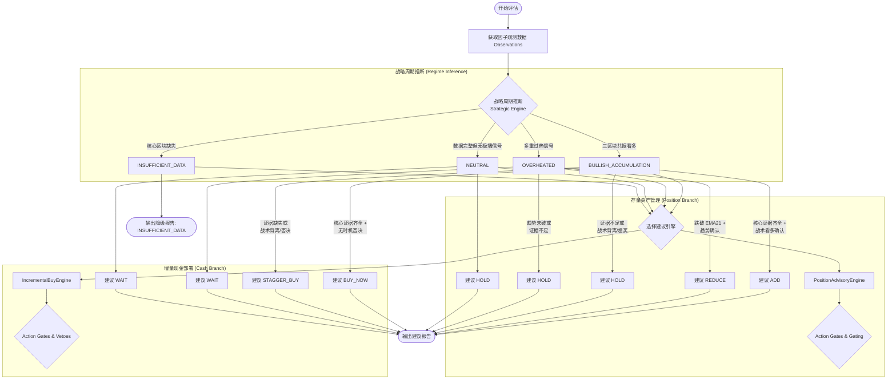

# BTC Monitor: 比特币长线分层定投与仓位管理系统

[](https://www.python.org/downloads/release/python-3120/)
[](https://www.docker.com/)
[](/tests/unit)

**BTC Monitor** 是一个面向比特币长期投资者的量化决策支持工具。系统采用了“无状态高确信度建议引擎 (Stateless Advisory Engine)”架构，不再直接接管预算与执行，而是通过严谨的证据分块、回退限制与置信度打分，来输出最高质量的长期分批建仓与减仓建议：

1. 当前战略周期是否支持建仓（或减仓）
2. 战术级别是否确认了相应的时机
3. 通过严格的操作门槛（Action Gates）给出最终建议：基于存量仓位的 `ADD/REDUCE/HOLD` 与基于增量现金的 `BUY_NOW/STAGGER_BUY/WAIT`

> **核心约束**
> 本项目禁止使用任何付费 API、付费数据源、试用后收费数据接口或商业终端数据。生产决策仅依赖免费公开数据。

> **运行方式**
> 项目已移除内部常驻调度，需要由外部调度系统触发，推荐每周运行一次。

---

## 核心架构

### 1. 战略层 Strategic

战略层决定长期配置方向，只使用慢变量和高解释力因子：

- `MVRV_Proxy`
- `Puell_Multiple`
- `200WMA`
- `Cycle_Pos`
- `Net_Liquidity`
- `Yields`

输出战略状态：

- `AGGRESSIVE_ACCUMULATE`
- `NORMAL_ACCUMULATE`
- `DEFENSIVE_HOLD`
- `RISK_REDUCE`

### 2. 战术层 Tactical

战术层只负责执行时机确认，不负责决定长期方向：

- `RSI_Div`
- `FearGreed`

输出时机状态：

- `BUY_NOW`
- `STAGGER_BUY`
- `WAIT`

### 3. 双分支建议层 (Dual-Branch Advisory Layer)

建议层严格无状态且具备双重决策逻辑，通过独立的评估路径处理不同资金性质的需求：

#### A. 存量资产管理 (Position Branch)
评估现有 BTC 仓位的调整建议：
- `ADD`: 明确的增配信号（需战略与战术双确认且证据完整）
- `REDUCE`: 明确的减配信号
- `HOLD`: 不满足操作条件，持币观望

#### B. 增量现金部署 (Incremental Cash Branch)
评估法币/稳定币新资金的入场时机：
- `BUY_NOW`: 极高确信度时机，建议立即全额部署当前批次
- `STAGGER_BUY`: 战略看好但战术存在背离，建议分批部署或等待更优 intra-week 价格
- `WAIT`: 时机不佳，建议维持 DCA 或持现等待

#### C. 保守回退 (Fail-Closed)
- `INSUFFICIENT_DATA`: 核心区块数据缺失，或关键门禁（Hard Gates）未通过时，系统会自动降级信号，并在报告中显式列出 `missing_required_factors`。

---

## 因子分层与状态

### 生产核心因子

这些因子会进入生产评分：

- `MVRV_Proxy`
- `Puell_Multiple`
- `200WMA`
- `Cycle_Pos`
- `Net_Liquidity`
- `Yields`
- `RSI_Div`
- `FearGreed`

### 研究因子

这些因子仍会显示在报告中，但已经冻结为 `research-only`，**不再参与生产评分**：

- `Production_Cost`
- `Options_Wall`
- `ETF_Flow`

冻结原因：

- 免费历史数据不可回放
- 数据源稳定性不足
- 当前实现仍属于研究代理，不适合作为生产决策依据

---

## 数据源策略

### 允许的免费数据源

- BTC 行情：`Binance public`, `Yahoo Finance`, `CoinGecko`, `CryptoCompare`
- 宏观数据：`FRED`
- 链上免费数据：`Blockchain.com`, `Mempool.space`
- 情绪数据：`Alternative.me Fear & Greed`

### 明确禁止

- 任何付费 API
- 任何需要 billing setup 的数据接口
- 只有实时免费、历史收费的核心生产信号
- 无法稳定回测复现的主评分数据源

---

## 因子系统详细说明

系统通过 `src/strategy/factor_registry.py` 定义了因子的多层级属性。因子分为三个层级：**战略层 (Strategic)**、**战术层 (Tactical)** 和 **研究层 (Research)**。

### 1. 战略因子 (Strategic Layer) - 决定大周期方向

战略因子用于推断市场当前所处的周期阶段（Regime），通过三个独立的证据区块（Evidence Blocks）进行聚合。

| 区块 (Block) | 因子名称 | 用途 | 逻辑说明 | 权重 |
| :--- | :--- | :--- | :--- | :--- |
| **估值 (Valuation)** | `MVRV_Proxy` | 衡量 BTC 市场价值与实现价值的比率 | 反映长期持有者的盈亏状态。高 MVRV 代表过热，低 MVRV 代表深跌。 | 1.5 |
| | `Puell_Multiple` | 衡量矿工收入与历史均值的比率 | 从供应端评估压力。低值通常对应周期底部（矿工投降）。 | 1.2 |
| | `Hash_Ribbon` | 监测算力金叉/死叉 | 识别矿工算力增长恢复的信号。 | 1.0 |
| **趋势 (Trend/Cycle)** | `200WMA` | 200 周移动平均线 | 比特币长期牛熊的分界线，价格位于其下方通常是极佳积累区。 | 1.0 |
| | `Cycle_Pos` | 距离减半周期的位置 | 结合历史四年周期规律评估当前所处的时间节点。 | 1.0 |
| **宏观 (Macro)** | `Net_Liquidity` | 全球央行/美联储净流动性 | 比特币是流动性敏感资产，流动性扩张是牛市的核心引擎。 | 1.0 |
| | `Yields` | 美债收益率/利差 | 评估风险资产的贴现率环境与衰退风险。 | 1.0 |
| | `DXY_Regime` | 美元指数走势 | 美元走势通常与 BTC 呈负相关，提供额外的宏观背景。 | 1.0 |

### 2. 战术因子 (Tactical Layer) - 确认入场/出场时机

战术因子不决定方向，仅在战略方向确定的前提下，负责寻找更优的执行点或提供风险否决。

| 因子名称 | 用途 | 逻辑说明 |
| :--- | :--- | :--- |
| `RSI_Div` | 价格与 RSI 的背离 | 识别短期趋势衰竭与反转的信号。 |
| `FearGreed` | 恐慌贪婪指数 | 情绪指标。极端贪婪时限制买入（Wait Veto），极端恐慌时提供逆向参考。 |
| `Short_Term_Stretch` | 短期价格乖离率 | 评估价格是否在短期内过度拉升，防止在“针尖”上追高。 |
| `EMA21_Weekly` | 21 周指数移动平均线 | 牛市支撑线。跌破该线通常被视为中线趋势走弱的确认（REDUCE 必要条件）。 |

---

## 决策逻辑可视化 (Decision Tree)

系统采用双分支决策逻辑，分别处理**存量仓位调整**与**新资金部署**。



---

## 决策逻辑详述

### 1. 战略周期推断 (Strategic Regime)
系统首先通过 `StrategicEngine` 对各个区块的因子进行加权评分，聚合出区块分数（Block Scores）：
- **BULLISH_ACCUMULATION (看多积累期)**：要求“估值”、“趋势/周期”、“宏观流动性”三个区块的分数**同时**大于 3.0。这确保了必须在基本面、技术面和宏观面达成共振时才会发出强烈看多信号。
- **OVERHEATED (过热风险期)**：当估值与趋势分数均低于 -3.5，或三个区块均低于 -3.0 时触发。代表市场已进入疯狂阶段，风险收益比极低。
- **NEUTRAL (中性/过渡期)**：数据齐全但未触及极端阈值。
- **INSUFFICIENT_DATA (数据缺失)**：当核心战略区块（估值、趋势、宏观）中有任何一个无法获取有效数据时，系统进入此状态并回退所有激进建议。

### 2. 存量建议分支 (Position Branch: ADD / REDUCE / HOLD)
- **ADD 触发逻辑**：
    1. 战略处于 `BULLISH_ACCUMULATION`。
    2. **硬门控 (Hard Gates)**：必须覆盖 `MVRV_Proxy`, `Puell_Multiple`, `200WMA`, `Cycle_Pos`, `Net_Liquidity`, `Yields` 等核心因子。
    3. **战术确认**：战术状态必须为 `BULLISH_CONFIRMED`（或战略分数极强且战术中性）。如果战术呈现 `BEARISH_CONFIRMED`（如严重超买或背离），建议将降级为 `HOLD`。
    4. **单因子否决**：若存在任何非研究类因子分数低于 -5.0，信号会被强制降级为 `HOLD`。
- **REDUCE 触发逻辑**：
    1. 战略处于 `OVERHEATED`。
    2. **趋势破位**：必须跌破 `EMA21_Weekly` 或呈现明显的趋势转弱。
    3. **战术配合**：战术面不能处于强多头状态。

### 3. 现金建议分支 (Cash Branch: BUY_NOW / STAGGER_BUY / WAIT)
- **BUY_NOW (立即买入)**：
    - 战略必须看多，且所有核心证据齐全。
    - 无战术否决：`FearGreed` 不能极度贪婪，短期价格不能过度乖离（Short-Term Stretch）。
- **STAGGER_BUY (分批建仓)**：
    - 当战略看多但证据覆盖不全，或存在轻微战术背离时，系统会建议“分步走”，以规避短期波动风险。
- **WAIT (持现等待)**：
    - 在过热或中性环境下，系统不建议进行新增资本的 Lump-sum 部署。

### 4. 置信度校准与回退 (Calibration & Fail-Closed)
每个最终建议都会经过 `calibration.py` 计算置信度 (Confidence)：
- 置信度受**证据一致性 (Agreement Weight)** 与**战术匹配度**共同驱动。
- **Fail-Closed 机制**：若关键因子缺失，系统绝不会冒险给出 `ADD` 或 `BUY_NOW` 建议，而是显式在报告中指出 `blocked_reasons`，并将动作回退至 `HOLD` 或 `WAIT`。

---

## 项目结构

```text
btc-monitor/
├── src/
│   ├── main.py
│   ├── config.py
│   ├── fetchers/
│   ├── indicators/
│   ├── strategy/
│   │   ├── position_advisory_engine.py  # 仓位分支
│   │   ├── incremental_buy_engine.py   # 现金分支
│   │   ├── factor_models.py
│   │   ├── factor_registry.py          # 门禁与因子定义
│   │   ├── strategic_engine.py
│   │   ├── tactical_engine.py
│   │   ├── calibration.py              # 置信度校准器
│   │   ├── block_utils.py              # 共享聚合工具
│   │   └── reporting.py
│   ├── state/
│   └── backtest/
│       ├── position_backtest_runner.py
│       ├── cash_backtest_runner.py
│       └── generate_dual_report.py
├── tests/unit/
├── data/
├── docs/plans/
├── Dockerfile
└── docker-compose.yml
```

---

## 快速开始

### 1. 环境准备

建议使用 Docker 运行。宿主机本地开发则使用 Python 3.12。

### 2. 配置

1. 复制环境变量模板：`cp .env.example .env`
2. 配置 `FRED_API_KEY`
3. Telegram 通知为可选项

### 3. 运行评估

```bash
docker build -t btc-monitor .
docker run --rm --env-file .env -v $(pwd)/data:/app/data btc-monitor
```

### 4. 运行单元测试

```bash
docker run --rm --env-file .env btc-monitor pytest tests/unit
```

### 5. 运行回测

```bash
# 运行仓位建议回测
docker compose run --rm app python src/backtest/position_backtest_runner.py

# 运行增量买入回测
docker compose run --rm app python src/backtest/cash_backtest_runner.py

# 生成双决策对比报告
docker compose run --rm app python src/backtest/generate_dual_report.py
```

### 6. 使用 docker compose

```bash
docker compose build
docker compose run --rm app
docker compose run --rm tests
```

---

## BTC Monitor V3.0 (TADR) 生产部署指南

V3.0 引入了 **Target Allocation & Dynamic Regime (TADR)** 架构，实现了从离散指令到概率化目标仓位的进化。

### 1. 核心配置说明 (`src/strategy/factor_registry.py`)
在 V3.0 中，`FactorRegistry` 驱动引擎行为。关键配置字段：
- **`is_critical` (Boolean)**: 
    - 标记为 `True` 的因子被视为系统“感知”的核心。
    - **Fail-Closed 逻辑**: 若有 2 个或更多关键因子失效（Invalid 或数据过期 > 72h），系统将进入 `SYSTEM_GATE_LOCKED` 熔断状态，强制将建议设为 `WAIT`。
- **`default_weight` (0.0 - 10.0)**: 
    - 基础权重。在运行时，`CorrelationEngine` 会根据资产相关性自动对冗余因子执行平滑缩放。

### 2. 容器化运行 (Production Mode)
系统推荐在受限环境下运行以保证稳定性：
```bash
# 构建并拉起生产环境
docker compose up --build -d app
```
**生产环境特性**:
- **资源隔离**: 容器限制为 `0.5 CPU` / `512M RAM`，防止回测对宿主机的侵占。
- **时区强制**: 全链路强制 `UTC` 对齐，消除时间戳漂移。
- **原子化报告**: 报告生成的 `docs/report.md` 采用临时文件替换逻辑，确保外部读取始终完整。

### 3. 可观测性与归因 (RCA)
查阅报告中的 **Root Cause Analysis (RCA)** 表格可进行深度诊断。系统会高亮展示：
- 被压制的因子（Multiplier < 1.0）。
- 缺失的原始分值。
- 熔断触发的具体因子名单。

---

## 报告输出

当前报告会展示：

- `Final Score`
- `Strategic Score`
- `Tactical Score`
- `Regime`
- `Timing`
- `Strategic Coverage`
- `Missing Required Core Factors`
- `Excluded Research Factors`

示例：

```text
# BTC Monitor Advisory Report
**Action:** `ADD`
**Confidence:** `90` / 100
**Regime:** `BULLISH`
**Tactical State:** `CONFIRMED_UP`
**Price:** $65,000.00

**Summary:** Strong conviction standard allocation.

## Confluence Analysis
**Supporting Factors:** MVRV_Proxy, 200WMA, Puell_Multiple, RSI_Div
```

---

## 回测说明

回测现在已对齐 live 评分框架：

- 使用同一套分层合成规则
- 使用免费历史链上估值数据
- 研究因子保持 `research-only`
- 新增了 live/backtest parity 测试，避免线上线下评分逻辑再次漂移

需要注意：

- `FearGreed`、`Options_Wall`、`ETF_Flow` 缺乏稳定免费历史回放，回测中不进入生产评分
- 当前回测已经比旧版本更接近 live，但仍是策略验证工具，不是交易仿真系统

---

## 当前状态

本仓库当前已完成：

- 研究因子冻结
- 分层评分架构
- 执行决策引擎
- 时区感知状态管理
- 报告覆盖率诊断
- live/backtest parity 校验

当前单元测试状态：`89 passed`

---

## 免责声明

本项目仅用于技术研究与策略实验，不构成任何投资建议。加密资产波动极高，请独立判断并自担风险。
