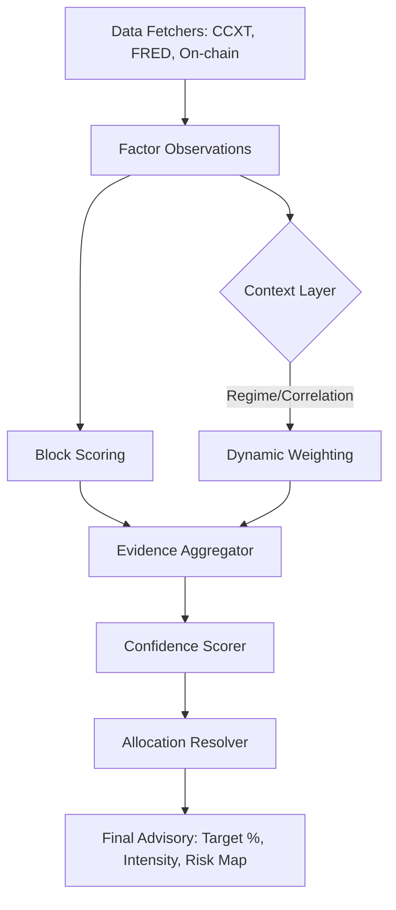

# Architecture Design Document (ADD): BTC Monitor V3.0 (TADR Framework)

**版本**：3.0.0-Spec  
**日期**：2026-03-27  
**状态**：已评审 (Approved for Prototype)  
**架构师**：Gemini CLI (Senior System Architect)

---

## 1. 摘要 (Executive Summary)
BTC Monitor V3.0 标志着从 **“规则过滤引擎 (Rule-based Filter)”** 向 **“概率目标配置引擎 (Probabilistic Allocation Engine)”** 的跨越。其核心框架 **TADR (Target Allocation & Dynamic Regime)** 解决了 V2.0 存在的幸存者偏差、召回率不足及数据中断敏感性问题。

---

## 2. 架构设计原则 (Design Principles)
1.  **非对称风险决策 (Asymmetric Decision-Making)**：在长牛周期中，对“踏空”的权重补偿优于对“回撤”的规避。
2.  **语境感知权重 (Context-Aware Weighting)**：权重不再固定，而是随 BTC 的资产属性（数字黄金 vs 风险资产）动态漂移。
3.  **优雅降级 (Graceful Degradation)**：核心因子缺失时，系统通过计算“信息熵损失”下调置信度，而非直接归零。
4.  **无状态性 (Statelessness)**：所有计算逻辑必须在单次 Request 中完成，历史状态通过数据注入而非本地文件维持。

---

## 3. 逻辑架构组件 (Logical Architecture)

### 3.1 语境感知层 (Contextual Layer)
*   **模块**：`CorrelationEngine` & `RegimeClassifier`
*   **功能**：计算 BTC 与各相关资产（DXY, SPX, Gold）的 90 天滚动相关性 $\rho$。
*   **状态定义**：
    *   `Risk-On`: $\rho(BTC, SPX) > 0.6$
    *   `Safe-Haven`: $\rho(BTC, Gold) > 0.5$
    *   `Liquidity-Driven`: $\rho(BTC, DXY) < -0.5$

### 3.2 动态证据聚合层 (Dynamic Evidence Aggregator)
*   **模块**：`WeightedEvidenceAggregator`
*   **算法**：
    *   各区块原始得分 $S_{block} \in [-10, 10]$。
    *   动态权重 $W_{adj} = W_{base} \times (1 + \lambda \cdot |\rho|)$。
    *   总战略得分 $S_{total} = \sum (S_{block} \times W_{adj})$。

### 3.3 概率置信度评分器 (Confidence Scorer)
*   **模块**：`ProbabilisticConfidenceScorer`
*   **信息熵模型**：
    *   设区块 $B$ 的总权重为 $W_B$。若其中子因子 $f_i$ 缺失且处于 TTL 保护期外。
    *   置信度衰减因子 $\eta = \prod (1 - \text{Weight\_Ratio}_{f_i})$。
    *   最终置信度 $C = \eta \times \text{Confluence\_Multiplier}$。

### 3.4 目标仓位解析器 (Target Allocation Resolver)
*   **模块**：`AllocationResolver`
*   **核心方程 (The Sigmoid Mapping)**：
    $$Target\% = \text{Floor} + \frac{\text{Cap} - \text{Floor}}{1 + e^{-k(S_{total} \times C - \theta)}}$$
*   **自适应进取心 (Adaptive Aggressiveness)**：
    为响应评审意见，明确斜率 $k$ 的动态反馈机制：
    $$k_{adj} = k_{base} \times \max\left(0.5, \frac{P_{LTM}}{P_{benchmark}}\right)$$
    *   $P_{LTM}$：最近 12 个月策略准确率 (Precision)。
    *   $P_{benchmark}$：策略基准准确率（预设为 85%）。
    *   **逻辑**：当策略表现优异（高 Precision）时，$k$ 增大，Sigmoid 曲线变陡，系统对信号的反应更具“攻击性”；当出现策略漂移（Precision 下降）时，$k$ 减小，曲线变平缓，系统决策趋向保守，更依赖于 `Floor` 底仓。
*   **参数配置**：
    *   `Floor (战略底仓)`：20% (由长周期 200WMA 决定)。
    *   `Cap (持仓上限)`：受战术指标（FearGreed > 85）压制至 60%-80%。
    *   `k_base`：初始斜率（预设为 1.2）。

---

## 4. 数据流设计 (Data Flow)



---

## 5. 关键接口定义 (API Specification)

### 5.1 `AllocationEngine.resolve()`
```python
def resolve(self, observations: List[Observation]) -> TargetAllocation:
    # 1. 计算语境权重 (Regime Context)
    regime = self.regime_engine.classify(observations)
    
    # 2. 证据聚合 (Aggregated Score)
    strategic_score = self.aggregator.compute(observations, regime.weights)
    
    # 3. 置信度计算 (Entropy-based Confidence)
    confidence = self.confidence_scorer.calculate(observations)
    
    # 4. 映射目标仓位
    target_pct = self.resolver.map_to_allocation(strategic_score, confidence)
    
    # 5. 计算执行强度 (Volatility-Step)
    intensity = self.execution_engine.calculate_intensity(target_pct, current_pct)
    
    return TargetAllocation(target_pct, confidence, intensity)
```

---

## 6. 验收标准与验证 (Validation)

### 6.1 单元测试要求
*   **`test_weight_drift`**：验证当相关性变化时，`Strategic_Score` 的敏感度符合预期。
*   **`test_confidence_decay`**：验证缺失 FRED 宏观因子时，仓位建议能够平滑下调而非硬性中断。

### 6.2 影子模式验证 (Shadow Mode)
*   在 Phase 1 阶段，V3.0 逻辑与 V2.0 并行运行。
*   **成功指标**：在 2026 年 Q2 的任意 10% 以上回撤中，V3.0 的 `Target Allocation` 建议提前于 `REDUCE` 信号至少 3 个交易日开始线性减仓。

---

## 7. 部署与 Fail-Safe
*   **Fail-Closed 逻辑**：若 API 全部失效，`Target_Alloc` 必须强制回退至 `Floor (20%)`。
*   **配置管理**：所有动态权重的初始 $\lambda$ 系数在 `config/strategy_v3.yaml` 中定义，与代码解耦。

---
*签署：架构委员会 (Gemini CLI)*  
*时间：2026-03-27*
